# Quantum Activation Function

# Task

Implement Quantum Multi-Perceptron Layer with Arbitrary Activation Function

# HOW TO

```bash
cd Quantum-Activation-Function

#use python 3.12.6 version
pip install -r requreiment.txt

#1d-function
cd 1d-function
python3 main.py

#2d-function
cd 2d-image
python3 main.py

#revise config.py for set parameter
python3 main.py
```


## 1d-function
  - Model
    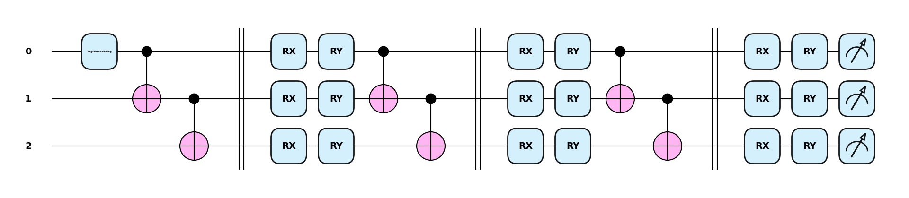|


- Numerical results
  | layer | $\sin{x}$|$\tanh{x}$ | $\frac{1}{2{\pi}}x$ |
  |---|---|---|---|
  |MLP (3 layers) | 0.0 | 0.0 | 0.0| \\
  |MLP (4 layers) | 0.0 | 0.0 | 0.0 |
  |MLP (5 layers) | 0.0 | 0.0 | 0.0 |
  |PQC (3 layers) | 0.0 | 0.0 | 0.003 |
  |PQC (4 layers) | 0.0 | 0.0 | 0.003 |
  |PQC (5 layers) | 0.0 | 0.0 | 0.003 |

   | $\sin{x}$| $\frac{1}{2{\pi}x}$|
   |---|---|
   | 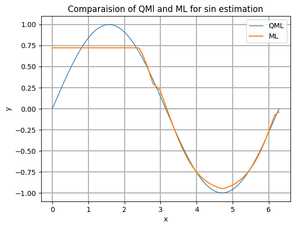| 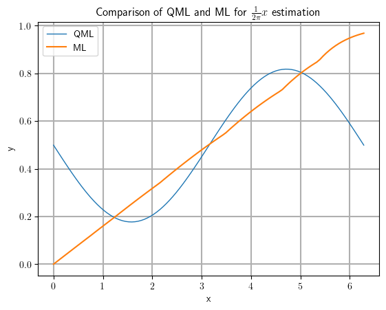| |


## 2d-function

  - Model
    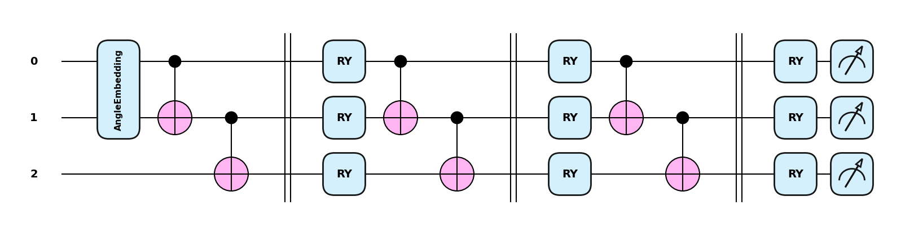|


| Image 1 | Image 2 | Image 3 |
|---|---|---|
| MLP (3 layers) | 15.826 | 16.913 | 15.884 |
| MLP (4 layers) | 15.816 | 17.049 | 16.328 |
| MLP (5 layers) | 15.811 | 16.606 | 16.306 |
| PQC (3 layers) | 14.503 | 16.269 | 15.470 |
| PQC (4 layers) | 15.624 | 16.464 | 15.471 |
| PQC (5 layers) | 4.484 | 6.912 | 8.786 |


  |Method | Image1| Image2| Image3|
   |---|---|---|---|
   |Origin|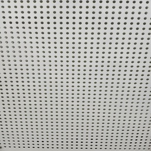 |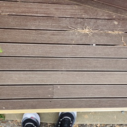 | |
   |MLP| | 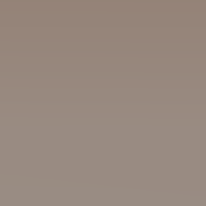| |
   |PQC| | | |


## QAF

- $Lemma1$

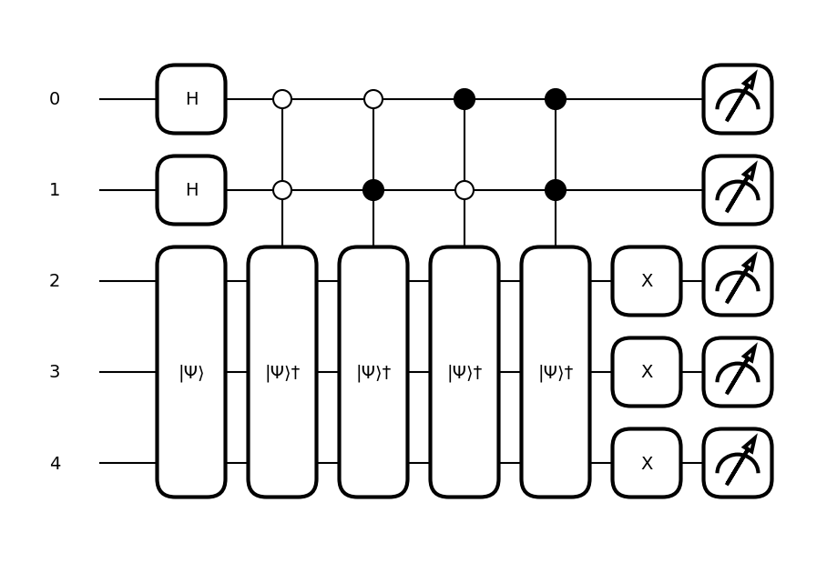|


- $Theorem1$

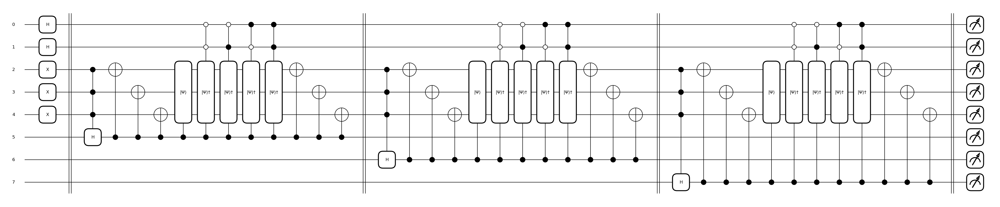|


- $Theorem2$

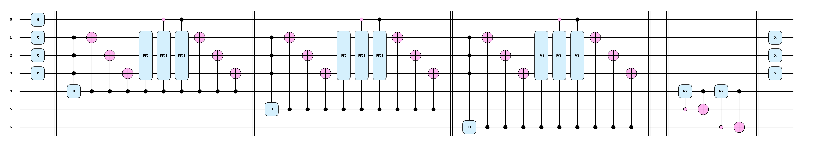|

- Result

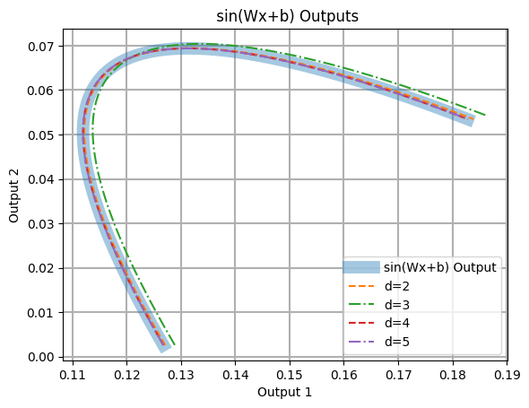|
